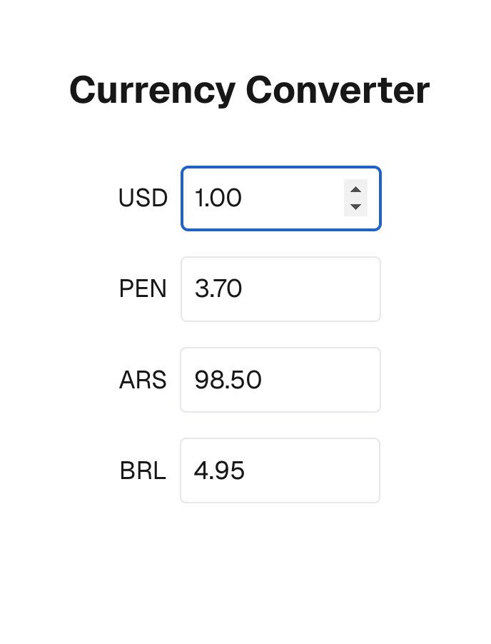

# Currency Converter

This project is a Next.js application that converts currencies in real-time. It features:

- Real-time conversion between multiple currencies using dynamic API data and static fallback rates.
- A simple user interface for entering amounts and viewing converted values instantly.



## Project Structure

- **app/**: Contains the Next.js pages and data (including exchange rates).
- **scripts/**: Contains utility scripts such as update-rates.js for updating the exchange rate JSON file.

## Getting Started

First, run the development server:

```bash
npm run dev
# or
yarn dev
# or
pnpm dev
# or
bun dev
```

Open [http://localhost:3000](http://localhost:3000) with your browser to see the result.

You can start editing the page by modifying `app/page.tsx`. The page auto-updates as you edit the file.

## Updating Exchange Rates

This project uses a script to update the exchange rates from an external API and combine them with static fallback rates. To update the rates, run:

```bash
npm run update-rates
```

**Note:** The script `update-rates.js` uses static fallback rates for some currencies (PEN and ARS) which are updated manually. Check the script for update timestamps and update the fallback rates as needed.

## Learn More

To learn more about Next.js, check out the following resources:

- [Next.js Documentation](https://nextjs.org/docs)
- [Learn Next.js](https://nextjs.org/learn)

## Deploy on Vercel

The easiest way to deploy your Next.js app is to use the [Vercel Platform](https://vercel.com/new).
